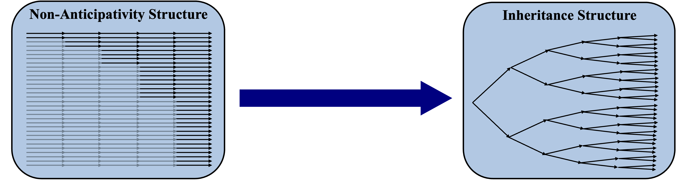

# PyStoch Opt  [](https://opensource.org/licenses/MIT) [](https://www.imperial.ac.uk)

PyStochOpt is an indexing and sampling module, primarily designed to aid in building stochastic energy systems models in python. This module is build in rust and can be used to remove the need for computationally expensive non anticipativity constraints. This module is used extensively throughout my research. See the theory section for more!

## Quickstart
This module is built in rust in order to leverage parallelisation to vastly improve execution speeds. As such it is necessary to install rust on your local machine to use this package. 
### Step 1: Install Rust

1. Open your terminal.
2. Run the following command to install Rust using `rustup` (the Rust toolchain installer):

    ```sh
    curl --proto '=https' --tlsv1.2 -sSf https://sh.rustup.rs | sh
    ```
    Or through anaconda...

    ```sh
    conda install conda-forge::rust
    ```

3. Follow the on-screen instructions to complete the installation.
4. After installation, ensure that Rust is installed correctly by running:

    ```sh
    rustc --version
    ```

    This should display the version of Rust installed.

### Step 2: Install Maturin

1. With Rust installed, you can now install Maturin. Run the following command in your terminal:

    ```sh
    pip install maturin
    ```
    This should display the version of Maturin installed.

For more information, refer to the official documentation:
- [Rust Documentation](https://www.rust-lang.org/learn)
- [Maturin Documentation](https://maturin.rs/)

### Step 3: Clone this repository
```sh
git clone https://github.com/cja119/PyStochOpt.git
```
### Step 4: Build The Module

```sh
maturin develop
```

This should succesfully build the module and store it in your native python location (pay attention to which location it prints when the module is built)

## Example Script

The below exerpt builds a 3 stage, 3 scenario stochastic grid where each stage lasts 168 hours. It then builds two time sets: one with a heirarchy for decisions made every 24 hours and another for an hourly decision, but with a 1 hour delay (useful for modeling difference equations, for example). 

```py
import PyStochOpt

# Building a stochastic grid with 3 stages, each of which lasts 168 hours with 3 stochastic scenarios (ie, three branches per stage).
StochasticGrid = PyStochOpt.StochasticGrid(n_stages = 3, n_scenarios = 3, stage_duration = 168)

# Building a heirarchical grid for a decision made every 48 hours
grid_48_hour = zip(StochasticGrid.get_grid(),StochasticGrid.new_grid(48))

# Building a hourly grid with a 1 hour delay. 
delay_1_hour = zip(StochasticGrid.get_grid(),StochasticGrid.new_grid(1,1))
```

# Theory
## Overview of Stochastic Modelling 
As aforementioned, this module is designed (primarily) for the use in energy systems models (though it is by no means exclusive to this use case!). With renewable energy systems models, there is unavoidable uncertainty as to the nature of weather patterns in the future and through employing stochastic modelling, the optimisation model is unable to anticipate the future weather patterns. This is achieved through a scneario tree with branch and leaf nodes, where every trajectory from root to leaf represents a single realisation of our probability space.

A key criterion of our stochastic tree is that it must maintain perfect contiguity for each trajectory from the root, all the way to the leaf nodes. This can be challenging to achieve and is often performed by 'bundling' together trajectories and subsequently employing specific constraints to make them act as one if they share common branches. (More on this below!)

## An Alternative Approach to Anticipativity

### Traditional Approach to Stochastic Optimisation
Typically for a stochastic optimisation model, the indices of all leaf nodes on the stochastic tree will be extended throughout the whole time domain. In order to prevent the optimisation model from being able to anticipate future events a set of 'non anticipaticity constraints' are used to enforce equality of variables in leaf nodes which share common branches (at times in the domain before the branches have split). A diagram of this structure is shown above: The 'greyed out' arrows represent the branches which are enforced to be equal to eachother. The black arrows represent 'leader branches' for which the variables are free to be optimised. The issue with this approach is that it generates lots of uneccesary variables in the optimisation model which just exist to mirror other variables. Furthermore, the indexing of these constraints is such that it is often best to build them individually using for loops and index based conditions. This results in a very complex presolve in certain optimisation languages, due to slow matrix generation as thousands of individual constraints have to be added to the model. 

### Inheritence Approach
This module uses an inheritence based approach wherin leaf nodes are not extended throughout the whole time domain. Rather, specific indexing rules are used to infer continuity from one branch to another and, eventually, to the leaf node. This approach produces no uneccessary variables or equalities constraints, and is much less computationally inexpensive to deploy than the traditional approach. This not only vastly improves the complexity of the optimisation model, but it also greatly improves matrix generation and presolve efficiency. The way this module is coded allows for the quick conversion of a deterministic model to a stochastic model.

## How the Inheritence Approach Works in This Module
Consider an energy systems model where you have a windfarm which powers a bank of electrolysers, which then feed into a set of gaseous hydrogen storage tanks. Each week you must decide how many trucks come and collect your hydrogen. Your plant is in a remote area and, as such, is 'islanded' (ie, doesn't have a grid connection). It is crucial that you do not run out of power, so you keep a hydrogen fuel cell on site which can 'cannibalise' some of your hydrogen from storage, in order to keep your safety systems available. You know a weeks' worth of weather in advance but know the weather for each subsequent week can be 'good', 'average' or 'poor'. 

The challenge here is knowing how many trucks to load with hydrogen each week in order to avoid running out of hydrogen incase of poor weather in the future (remember your safety systems can not be without power!). Let's model the system for a month (4 weeks operation), with our weather data avilable for 1 hours operation. For this, you can build the following stochstic system, and index as follows (example shown using Pyomo). 

1. Importing the necessary packages
```py
import PyStochOpt
from Pyomo.environ import Set, Param, ConcreteModel, Objective, minimize, NonNegativeReals, NonNegativeIntegers, Constraint
```
2. Building the stochastic grid:

    Note that stage 0 (ie our root) always exists, so we have n_stages + 1 weeks duration. Building our base stochastic grid:
```py
stochastic_grid = PyStochOpt.StochasticGrid(n_stages = 3, n_scenarios = 3, stage_duration = 168)
```
3. Loading the weatherdataset:

    Now generating samples from our weatherdataset. This needs to be a csv with 2 columns, one for time and one for the weatherdata value.
    The sampler will pick a random point and then take a contiguous sample from it, building a full tree structure of samples.
```py
sampled_weather_data = stochastic_grid.add_dataset(file_name,file_path)
```
4.  Building Heirarcichal Grids:

    Building a heirarchical grid for a decision made every 168 hours (one week) for our truck devisions. This will, for each time instance in each branch, 'point' to the correct index of the        168 hour grid set. Eg, at time = 175 on branch 1, this will point to the value at time = 168 on branch 1 as this was the last point at which a decision was made.
```py
grid_168_hour = zip(stochastic_grid.get_grid(),stochastic_grid.new_grid(168))
```

- If our truck takes 8 hours to load with hydrogen, we may want to monitor the bays in our fuelling station. In order to do this we need to know how many
    trucks started loading 8 hours ago, as they will now be finished. However, this can be challenging when trying to maintain contiguity for each trajectory.
    For example at branch 2 at time = 172, we need to point into the past to time = 164. But, there is no branch 2 at time = 164 as we have crossed over a fork
    in the stochstic tree, this is actually inherited from branch 0. Thankfully, PyStochOpt handles this complexity and returns the right value when you employ
    the delay term.

```py
grid_168_hour_8_hour_delay = zip(stochastic_grid.get_grid(),stochastic_grid.new_grid(168,8))
```

- When we build our variable sets, we don't want a list of values which are repeated for each time point (as it will have lots of duplicates)
    If we call the remove_duplicates functionality on this grid, it will allow us to generate a list containing single values. 

```py
grid_168_hour_no_duplicates = stochastic_grid.remove_duplicates(stochastic_grid.new_grid(168))
```

- The need for this final grid will become more clear when we look at the hydrogen storage balance constriant.

```py
hydrogen_storage_grid = zip(stochastic_grid.get_grid(),stochastic_grid.new_grid(1,1),stochastic_grid.new_grid(168),stochastic_grid.new_grid(168,8))
````

5. Putting it all together
```py
# Let's build the model
model = ConcreteModel()

# Building Sets
model.time_tree = Set(initalize = stochastic_grid.get_grid(),dimen=2)
model.grid_168_hour = Set(initialize = grid_168_hour, dimen=4)
model.grid_168_hour_8_hour_delay = Set(grid_168_hour_8_hour_delay,dimen=6)
model.grid_168_hour_no_duplicates = Set(grid_168_hour_no_duplicates, dimen=2)
model.hydrogen_storage_grid = Set(hydrogen_storage_grid, dimen=8)

# Building Parameters
model.renewable_power = Param(model.time_tree, initialize=sampled_weather_data)
model.safety_systems_power = Param(initialise = 5) #GJ/H

# Building Variables
model.stored_hydrogen = Var(model.time_tree, within=NonNegativeReals)
model.stored_hydrogen_capacity = Var(within=NonNegativeReals)
model.curtailed_energy = Var(model.time_tree, within=NonNegativeReals)
model.hydrogen_production = Var(model.time_tree, within=NonNegativeReals)
model.electrolyser_capacity = Var(within=NonNegativeReals)
model.number_trucks = Var(grid_168_hour_no_duplicates, within=NonNegativeIntegers)

# Building Constraints
def energy_balance(self,s,t):
    return self.renewable_power[s,t] - self.curtailed_energy[s,t] - self.hydrogen_production[s,t] * 120 * 0.6 - self.safety_systems_power == 0

model.energy_balance = Constraint(model.time_tree, rule = energy_balance)

def hydrogen_storage_balance(self,s,t,s_0,t_0,s_t,t_t,s_t8,t_t8): 
    # s,t are from the normal decision tree.
    # s_0,t_0 are from the normal decision tree but with 1 hour delay
    # s_t,t_t are from the trucking decisions
    # s_t8, t_t8 are from the trucking devision but with an 8 hour delay (for loading).
    if t == 0:
        return Constraint.Skip
    if t_8 < t_t: # If our finish loading time is less than our start loading time. (When we are finished loading the pointers will point to the same value).
        return self.stored_hydrogen[s,t] - self.stored_hydrogen[s_0,t_0] - self.hydrogen_production[s,t] + self.number_trucks[s_t,t_t] * 2 == 0 # Assuming a charge rate of 2 t/h
    else:
        return self.stored_hydrogen[s,t] - self.stored_hydrogen[s_0,t_0] - self.hydrogen_production[s,t] == 0 

model.hydrogen_storage_balance = Constraint(model.hydrogen_storage_grid,rule=hydrogen_storage_balance)

def hydrogen_production_limit(self,s,t):
    return self.hydrogen_production[s,t] <= self.electrolyser_capacity

model.hydrogen_production_limit = Constraint(model.time_tree, rule = hydrogen_storage_balance)

def objective_function(self):
    return - f(NPV) # Omitting the cost function as this is just for demonstrations' sake.

model.objective = Objective(rule=objective_function, sense = minimise)

model.build_model()


```
