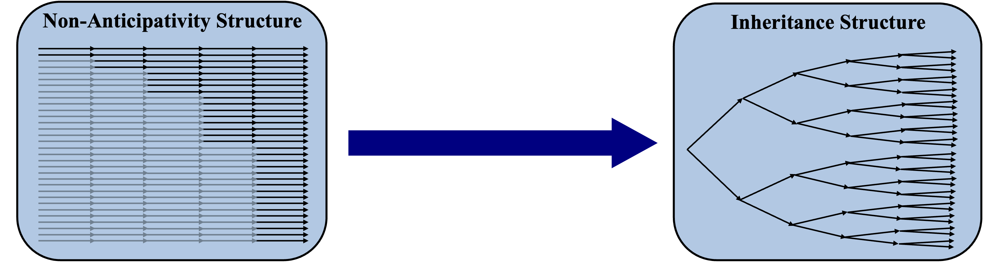

# Theory
## Overview of Stochastic Modelling 
As aforementioned, this module is designed (primarily) for the use in energy systems models (though it is by no means exclusive to this use case!). With renewable energy systems models, there is unavoidable uncertainty as to the nature of weather patterns in the future and through employing stochastic modelling, the optimisation model is unable to anticipate the future weather patterns. This is achieved through a scneario tree with branch and leaf nodes, where every trajectory from root to leaf represents a single realisation of our probability space.

A key criterion of our stochastic tree is that it must maintain perfect contiguity for each trajectory from the root, all the way to the leaf nodes. This can be challenging to achieve and is often performed by 'bundling' together trajectories and subsequently employing specific constraints to make them act as one if they share common branches. (More on this below!)

## An Alternative Approach to Anticipativity

### Traditional Approach to Stochastic Optimisation
Typically for a stochastic optimisation model, the indices of all leaf nodes on the stochastic tree will be extended throughout the whole time domain. In order to prevent the optimisation model from being able to anticipate future events a set of 'non anticipaticity constraints' are used to enforce equality of variables in leaf nodes which share common branches (at times in the domain before the branches have split). A diagram of this structure is shown above: The 'greyed out' arrows represent the branches which are enforced to be equal to eachother. The black arrows represent 'leader branches' for which the variables are free to be optimised. The issue with this approach is that it generates lots of uneccesary variables in the optimisation model which just exist to mirror other variables. Furthermore, the indexing of these constraints is such that it is often best to build them individually using for loops and index based conditions. This results in a very complex presolve in certain optimisation languages, due to slow matrix generation as thousands of individual constraints have to be added to the model. 

### Inheritence Approach
This module uses an inheritence based approach wherin leaf nodes are not extended throughout the whole time domain. Rather, specific indexing rules are used to infer continuity from one branch to another and, eventually, to the leaf node. This approach produces no uneccessary variables or equalities constraints, and is much less computationally inexpensive to deploy than the traditional approach. This not only vastly improves the complexity of the optimisation model, but it also greatly improves matrix generation and presolve efficiency. The way this module is coded allows for the quick conversion of a deterministic model to a stochastic model.

